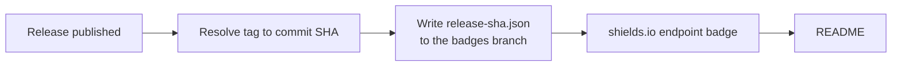

# sha-to-readme-action

Pinning a GitHub Action to a commit SHA is the [recommended way to use one safely][hardening] —
but nobody publishes that SHA anywhere obvious, so consumers have to go digging through
tags and commits to find it.

This action publishes it as a badge — plus a line you can actually select and copy — and
keeps both current on its own.

<!--sha-badge-->
[](https://github.com/Gary-H9/sha-to-readme-action/releases/tag/0.0.1)

```yaml
uses: Gary-H9/sha-to-readme-action@637db39298bf28f53b9433005d215ffbd8e463f6 # 0.0.1
```
<!--/sha-badge-->

## Usage

Add this once. It runs on every published release and needs no further attention.

```yaml
name: Release SHA badge

on:
  release:
    types: [published]

permissions:
  contents: write

jobs:
  badge:
    runs-on: ubuntu-latest
    steps:
      - uses: Gary-H9/sha-to-readme-action@<sha> # pin me, obviously
```

Then add these two markers to your README, anywhere you like:

```markdown
<!--sha-badge-->
<!--/sha-badge-->
```

On the next release the action fills that block in with the badge *and* a copy-pasteable
`uses:` line, and keeps it current from then on:

<!--example-->
[](https://github.com/Gary-H9/sha-to-readme-action/releases/tag/0.0.1)

```yaml
uses: Gary-H9/sha-to-readme-action@637db39298bf28f53b9433005d215ffbd8e463f6 # 0.0.1
```
<!--/example-->

If you'd rather keep your default branch free of commits, set `update-readme: false` and
embed the badge URL by hand instead — the workflow prints it in the job summary:

```markdown

```

That URL never changes, so it only ever needs pasting once.

## How it works

The badge URL never changes. Only the small JSON file it points at does.



The action resolves the release tag through the Git refs API, dereferencing annotated tags,
so the result is exactly the commit `actions/checkout` would give you. It then force-pushes a
[shields.io endpoint][endpoint] JSON file to an orphan `badges` branch, and rewrites the
marked block in your README so the SHA exists as selectable text too.

The badge value itself lives entirely on the `badges` branch, which means:

- the badge is correct the moment the release is published, whatever happens to the README
- no drift, where the badge value lands on a commit *after* the tag it claims to describe
- the README commit only ever *restates* the badge; it never *is* the badge

That last point is the whole design. An earlier version of this repo stored the SHA in the
README itself, so publishing the badge moved the default branch and immediately invalidated
what the badge claimed.

## Inputs

| Input | Default | Description |
|---|---|---|
| `token` | `github.token` | Needs `contents: write` to push the badge branch. |
| `tag` | triggering release tag | Tag to resolve. |
| `branch` | `badges` | Branch the badge JSON lives on. |
| `filename` | `release-sha.json` | Path of the JSON file on that branch. |
| `label` | `release sha` | Left-hand badge text. |
| `color` | `blue` | Badge colour. |
| `short` | `false` | Show the 7-character SHA instead of all 40. |
| `cache-seconds` | `300` | How long shields.io may cache the badge (minimum 300). |
| `update-readme` | `true` | Rewrite the README block — see below. |
| `readme-path` | `README.md` | README to rewrite. |
| `readme-branch` | default branch | Branch to commit the README change to. |

## Outputs

| Output | Description |
|---|---|
| `sha` | Full 40-character commit SHA the tag points at. |
| `badge-url` | shields.io endpoint URL to embed. |
| `json-url` | Raw URL of the published badge JSON. |

## The copy-pasteable line

A badge is an image: you can read the SHA off it, but you can't select it. So the action also
rewrites the block between the `sha-badge` HTML comment markers, giving you both:

```yaml
uses: OWNER/REPO@<40-char-sha> # v1.2.3
```

This is on by default. It costs one commit per release on `readme-branch`, and needs
`contents: write` there. Set `update-readme: false` to turn it off and keep a badge-only setup.

If the README or the markers are missing, the step logs a warning and moves on rather than
failing the run — the badge has already been published by that point, so there is nothing to
roll back. Push failures, by contrast, are real errors: the action retries against the new tip
three times before giving up.

## Caveats

- **Caching.** GitHub proxies README images through Camo, and shields.io caches too. A freshly
  published badge can take a few minutes to appear. It is not broken; give it five minutes.
- **Branch protection.** Exclude the `badges` branch from required checks and protection rules,
  or the force-push will be rejected.
- **The `badges` branch is a data store.** It is force-pushed on every release. Don't keep
  anything there you care about, beyond badge JSON.
- **Protected default branches.** With `update-readme` on, the README commit is pushed
  directly. If your default branch requires pull requests, use `update-readme: false` or point
  `readme-branch` somewhere writable.

## Setup

The badge only exists after the first run. Either publish a release, or run the workflow
manually via **Actions → Release SHA badge → Run workflow** to backfill from the latest
existing release.

[hardening]: https://docs.github.com/en/actions/security-for-github-actions/security-guides/security-hardening-for-github-actions#using-third-party-actions
[endpoint]: https://shields.io/badges/endpoint-badge
