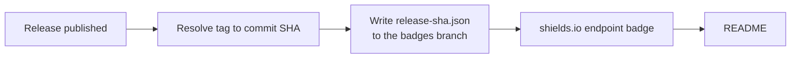

# sha-to-readme-action

Pinning a GitHub Action to a commit SHA is the [recommended way to use one safely][hardening] —
but nobody publishes that SHA anywhere obvious, so consumers have to go digging through
tags and commits to find it.

This action publishes it as a badge that stays current on its own.

<!--sha-badge-->
[](https://github.com/Gary-H9/sha-to-readme-action/releases/latest)
<!--/sha-badge-->

## Usage

Add this once. It runs on every published release and needs no further attention.

```yaml
name: Release SHA badge

on:
  release:
    types: [published]

permissions:
  contents: write

jobs:
  badge:
    runs-on: ubuntu-latest
    steps:
      - uses: Gary-H9/sha-to-readme-action@<sha> # pin me, obviously
```

Then paste the badge into your README, once and forever:

```markdown

```

The workflow prints the exact URL in its job summary, so you can copy it from the first run
rather than hand-encoding it.

## How it works

The badge URL never changes. Only the small JSON file it points at does.



The action resolves the release tag through the Git refs API, dereferencing annotated tags,
so the result is exactly the commit `actions/checkout` would give you. It then force-pushes a
[shields.io endpoint][endpoint] JSON file to an orphan `badges` branch.

Nothing on your default branch is ever modified, which is the important part:

- no push races against other jobs, and no `git pull --rebase` failures
- no noise commits in your history
- no workflow re-triggering itself
- no drift, where the badge lands on a commit *after* the tag it claims to describe

## Inputs

| Input | Default | Description |
|---|---|---|
| `token` | `github.token` | Needs `contents: write` to push the badge branch. |
| `tag` | triggering release tag | Tag to resolve. |
| `branch` | `badges` | Branch the badge JSON lives on. |
| `filename` | `release-sha.json` | Path of the JSON file on that branch. |
| `label` | `release sha` | Left-hand badge text. |
| `color` | `blue` | Badge colour. |
| `short` | `false` | Show the 7-character SHA instead of all 40. |
| `cache-seconds` | `300` | How long shields.io may cache the badge (minimum 300). |
| `update-readme` | `false` | Also rewrite the README block — see below. |
| `readme-path` | `README.md` | README to rewrite. |
| `readme-branch` | default branch | Branch to commit the README change to. |

## Outputs

| Output | Description |
|---|---|
| `sha` | Full 40-character commit SHA the tag points at. |
| `badge-url` | shields.io endpoint URL to embed. |
| `json-url` | Raw URL of the published badge JSON. |

## Making the SHA copy-pasteable

A badge is an image, so you can look at the SHA but you can't select it. If that matters more
to you than keeping the default branch untouched, set `update-readme: true`. The action will
rewrite the block between the `sha-badge` HTML comment markers with the badge plus a
ready-to-copy snippet:

```yaml
uses: OWNER/REPO@<40-char-sha> # v1.2.3
```

That does add one commit per release, and the workflow needs `contents: write` on the default
branch. The badge itself stays accurate either way.

## Caveats

- **Caching.** GitHub proxies README images through Camo, and shields.io caches too. A freshly
  published badge can take a few minutes to appear. It is not broken; give it five minutes.
- **Branch protection.** Exclude the `badges` branch from required checks and protection rules,
  or the force-push will be rejected.
- **The `badges` branch is a data store.** It is force-pushed on every release. Don't keep
  anything there you care about, beyond badge JSON.

## Setup

The badge only exists after the first run. Either publish a release, or run the workflow
manually via **Actions → Release SHA badge → Run workflow** to backfill from the latest
existing release.

[hardening]: https://docs.github.com/en/actions/security-for-github-actions/security-guides/security-hardening-for-github-actions#using-third-party-actions
[endpoint]: https://shields.io/badges/endpoint-badge
